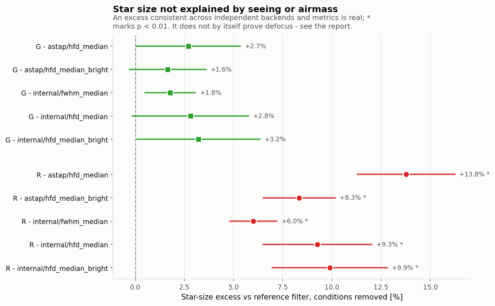
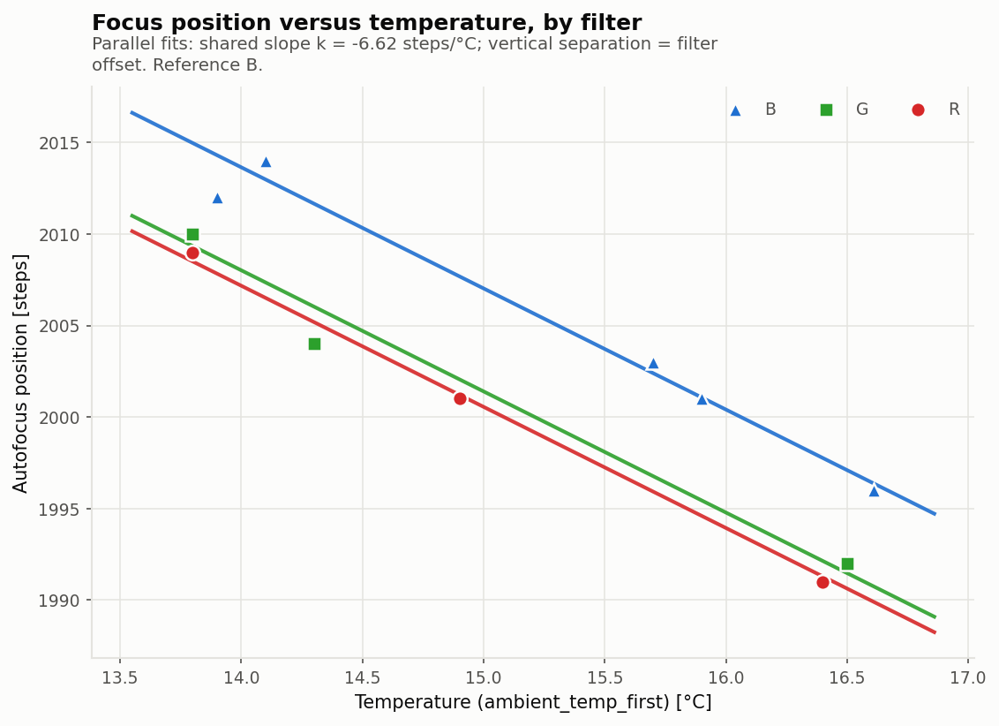
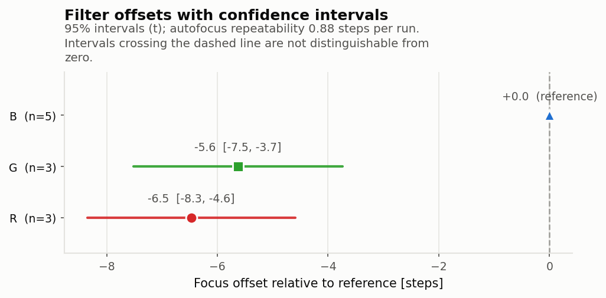
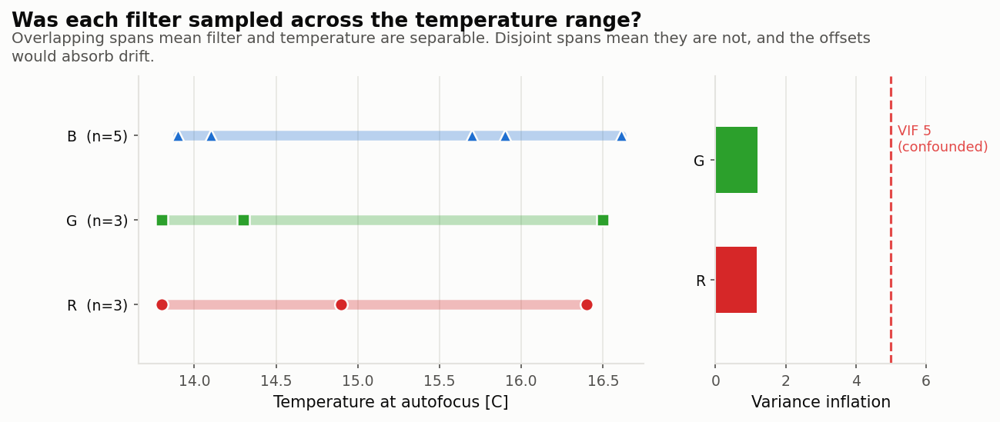
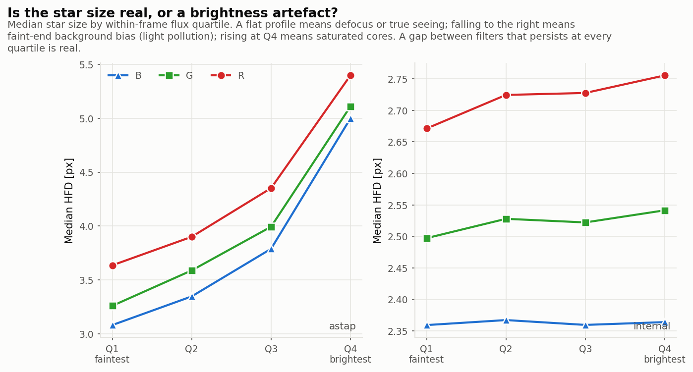
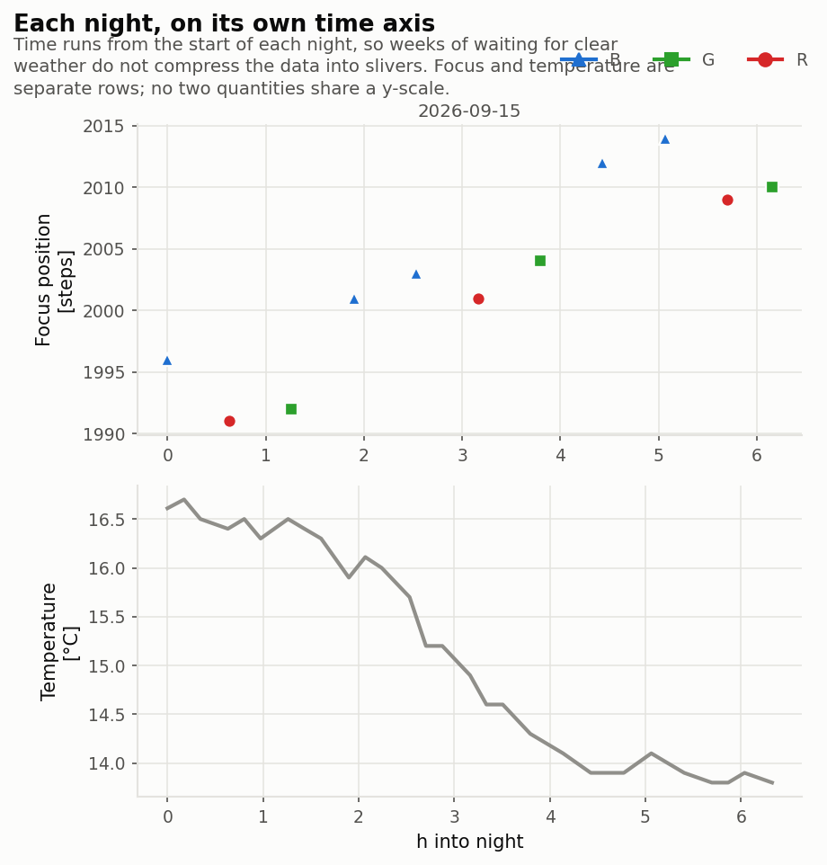

# Worked example -- Takahashi Epsilon 160ED + QHY600M, RGB, 2026-09-16

The dataset this package was developed against: 31 x 600 s subs of the Cocoon
Nebula, filters rotated B -> R -> G, autofocus after every filter change, captured
with APT 4.80 on a Mesu Mark II with a Pegasus FocusCube 3. Bortle 5 site.

_Produced with filteroffset v0.6.0._

```bash
filteroffset run lights -o out --step-microns 2.0
```

## What the data turned out to be

Segmentation recovered **11 autofocus blocks** of 3 subs each (the last has 1),
from `FILTER` + `FOCUSPOS` + timestamps alone:

| block | filter | position | T (C) | alt ( deg) | dead time before |
|---|---|---|---|---|---|
| 0 | B | 1996 | 16.61 | 72.8 | -- |
| 1 | R | 1991 | 16.40 | 78.7 | 437 s |
| 2 | G | 1992 | 16.50 | 82.8 | 435 s |
| 3 | B | 2001 | 15.90 | 81.8 | 446 s |
| 4 | B | 2003 | 15.70 | 76.8 | 453 s |
| 5 | R | 2001 | 14.90 | 70.7 | 445 s |
| 6 | G | 2004 | 14.30 | 64.4 | 437 s |
| 7 | B | 2012 | 13.90 | 57.9 | 445 s |
| 8 | B | 2014 | 14.10 | 51.6 | 435 s |
| 9 | R | 2009 | 13.80 | 45.3 | 440 s |
| 10 | G | 2010 | 13.80 | 40.9 | 437 s |

**Autofocus was verified, not assumed.** Dead time before each block is
435-453 s, against 14-29 s between subs inside a block. An autofocus run costs
real time, and the consistency of those gaps says every run completed normally.
The focuser also never moved *within* a block, so APT's own temperature
compensation was off -- `FOCUSPOS` is a clean autofocus result throughout.

## Result

| filter | offset (steps) | to enter | 95% CI | blocks |
|---|---|---|---|---|
| B | 0 (reference) | **0** | -- | 5 |
| G | -5.63 +/- 0.80 | **-6** | -7.51 ... -3.74 | 3 |
| R | -6.47 +/- 0.79 | **-6** | -8.34 ... -4.60 | 3 |

**k = -6.617 +/- 0.298 steps/C**, referenced at 15.08 C. Autofocus repeatability
0.88 steps per run, R^2 = 0.980.

G and R are indistinguishable from each other (0.84 steps apart, well inside the
noise) and both round to -6. B focuses about 6 steps further out than either.

## Were filter and temperature actually separable?

Yes, and this is the part worth dwelling on, because it is the whole basis of
the method.

The rotating filter order spread all three filters across nearly the identical
temperature range (B 13.9-16.6, G 13.8-16.5, R 13.8-16.4 C). Consequently:

- largest filter-term **VIF = 1.19** (>= 5 would mean confounded)
- strongest filter vs temperature correlation **|r| = 0.13**
- design condition number **1.52**

And the independent check, which is the convincing one -- estimating k using
**only within-filter block comparisons**, a calculation that is mathematically
incapable of seeing filter offsets at all:

| estimator | k (steps/C) |
|---|---|
| joint fit (offsets included) | -6.62 +/- 0.30 |
| **within-filter only (offset-blind)** | **-6.47 +/- 0.35** |
| B alone (5 blocks, 2.7 C) | -6.32 +/- 0.60 |
| G alone (3 blocks, 2.7 C) | -6.30 +/- 1.01 |
| R alone (3 blocks, 2.6 C) | -6.91 +/- 0.17 |

The two agree to well within their uncertainties. The separation is real, not an
artefact of the parameterisation.

## What is solid and what is not

Refitting under every defensible specification:

| variant | k | offset G | offset R |
|---|---|---|---|
| baseline (robust) | -6.62 | -5.63 | -6.47 |
| OLS | -6.47 | -5.63 | -6.22 |
| thermal lag 30 min | -6.75 | -5.95 | -6.22 |
| thermal lag 60 min | -7.12 | -5.88 | -6.05 |
| block-mean temperature | -6.46 | -5.62 | -6.14 |
| + altitude term | -5.69 | -5.83 | -6.38 |
| *+ elapsed time (confounded)* | *-3.16* | *-6.22* | *-6.26* |

Specifications that collapse onto the baseline -- here "robust (Huber)" and
"no thermal lag", both of which the defaults already choose -- are marked as
duplicates and excluded from the spread, so agreement is not double-counted.

**The offsets move by at most 0.53 steps. The coefficient moves by 1.43.** So
the offsets are a property of the data and the coefficient is partly a property
of the modelling choices -- hence "offsets: trustworthy, k: provisional".

The last row shows why. On one night, temperature and elapsed time correlate at
**r = -0.967**. Adding a plain time drift fits dramatically better
(RSS 11.3 -> 1.6) while halving k, because anything that drifts with time --
tube still catching up thermally, cable flexure, mirror settling -- is
indistinguishable from temperature. Only nights with *different* thermal
behaviour can break that.

Two physical explanations were tested for the same residual structure:

- **Thermal lag:** smoothing ambient temperature with tau ~ 30 min cuts residual
  scatter 45% (RSS 11.3 -> 6.25). At 11 blocks the AICc penalty for the extra
  parameter makes it a statistical tie (14.96 vs 15.78), so it is suggestive,
  not established -- which is one reason fitting the lag is opt-in rather than
  the default. Physically sensible: focus follows the glass and tube, which lag
  the air.
- **Altitude / flexure:** rejected. The coefficient is -0.077 +/- 0.056 steps/deg
  on its own, and +0.001 +/- 0.055 once the lag is included. No evidence of
  altitude-dependent flexure, despite altitude running 83 deg -> 41 deg.

## The R filter is genuinely soft

The most interesting finding, and the one the autofocus positions could never
have revealed. After removing the night's seeing trend and airmass, R stars are
larger than B by:

| metric / backend | excess | p |
|---|---|---|
| astap / hfd_median_bright | +8.3% | <0.001 |
| astap / hfd_median | +13.8% | <0.001 |
| internal / hfd_median_bright | +9.9% | <0.001 |
| internal / hfd_median | +9.3% | <0.001 |
| internal / fwhm_median | +6.0% | <0.001 |

(G shows only +1.7...+3.2%, marginal at p = 0.01...0.11.) The finding survives everything thrown at
it -- dropping the worst frame, dropping all frames with eccentricity > 0.5,
dropping the entire last two blocks -- never falling below +6.0% or p > 0.001.



Things that were ruled out as explanations:

- **Light pollution / faint-star background bias.** The decisive test is HFD by
  within-frame flux quartile. Background bias inflates only the faint end,
  giving a falling profile; the R-B gap is instead roughly *constant* across all
  four quartiles in both backends (0.285 px at Q1, 0.343 px at Q4). Raw sky
  levels above bias were also B 1175 > G 922 > R 774 ADU -- R is the *least*
  sky-loaded frame.
- **Saturated red stars.** Saturated pixel fractions are near-identical across
  filters (R 0.0171%, G 0.0147%, B 0.0159%).
- **An ASTAP quirk.** ASTAP's HFD is strongly brightness-dependent on this data
  (3.1 -> 5.0 px across quartiles); the internal adaptive-aperture measurement is
  flat (2.30 -> 2.34). They disagree on absolute scale by ~1.65x and still agree
  on the R excess.
- **Seeing drift.** R blocks always fall ~0.6 h *before* a G block and seeing
  improved through the night, which would inflate R -- but this is exactly what
  the spline-in-time term absorbs, and the excess persists.
- **Trailing.** The two frames with elongated stars were excluded by QC.

**What it means is genuinely ambiguous, and the report says so.** Either

**(a)** autofocus systematically lands off best focus in R -- at 2 um/step the
7.5% excess corresponds to about 7 steps of defocus, sign not recoverable -- in
which case the -6.47 offset inherits that error; or

**(b)** R is intrinsically softer. Plausible causes: residual chromatic
correction in the ED corrector, or deeper absorption of red photons in the
QHY600's back-illuminated sensor broadening the PSF, which is a known effect.

Near best focus these are indistinguishable in principle, not merely in this
dataset. **The tie-breaker is a focus sweep in R** (see below).

## Other checks

- **"The first sub after autofocus is the sharpest."** True in principle, not
  measurable here -- and quantifiably so. Measured change per frame:
  -0.028 +/- 0.016 px (p = 0.09, i.e. nothing). Predicted: with -0.084 C per
  frame and k = -6.6, the focuser drifts only 0.56 steps per frame, and because
  the V-curve is *quadratic* at its minimum that predicts **0.0008 px** of
  growth. Good news for the analysis: all three subs per block are equally
  usable, so each block is one clean measurement rather than one usable frame.
- **One coefficient serves all filters.** Per-filter slopes do not improve the
  fit (F = 0.21, p = 0.81), as expected since thermal drift is dominated by the
  shared tube and mirror. A single k plus fixed offsets is the right model for APT.
- **1 of 31 frames rejected** (R, block 9, 45 deg altitude): median eccentricity
  0.72 with a common elongation direction, plus a star size 1.5x the R median --
  tracking or wind, not focus. A second R frame in the same block is flagged as
  a warning. That frame is also the only one where the two backends disagree
  badly (41%), which is the expected behaviour: independent measurements agree
  on clean frames and diverge on damaged ones.
- **Offset significance.** At f/3.31 the depth of focus is ~24 um (quarter-wave)
  / ~23 um (seeing-limited, FWHM 2.74 px). At 2 um/step a 6.5-step offset is
  13 um -- 57% of the zone, so worth applying. Below ~1.5 um/step it stops
  mattering, which is why the report prints the conversion across step sizes
  rather than assuming one.

## What to do next

1. **Apply B = 0, G = -6, R = -6.** These are solid.
2. **Hold k = -6.6 steps/C as provisional.** Verify the sign in one move:
   autofocus, note the position, wait for a 1 C drop, autofocus again.
3. **Two or three more nights**, ideally with different thermal behaviour (one
   that warms, one that plateaus). This is what makes k trustworthy and adds
   per-night intercepts that immunise the offsets against zero-point shifts.
4. **Run a focus sweep in R** -- say 9 frames at +/-30 steps in 8-step increments,
   short subs are fine. It resolves the (a)/(b) ambiguity above *and* calibrates
   microns-per-step from the V-curve slope, replacing the nominal 2 um/step
   figure. `filteroffset` detects and fits sweeps automatically.
5. **Stop imaging below ~50 deg altitude** on this target, or investigate guiding
   and balance there.

---

## Figures

The offsets and the shared thermal slope, fitted together. The vertical
separation between the parallel lines *is* the filter offset:





The design-adequacy picture. Fully overlapping temperature spans and VIFs near 1
are what make the offsets separable from thermal drift:



The light-pollution test. The R-B gap persists at every brightness quartile in
both backends, so it is not faint-end background bias. Note also how differently
the two backends behave in absolute terms -- steeply brightness-dependent for
ASTAP, flat for the adaptive-aperture measurement -- while agreeing on the gap:



The night itself. Temperature plateaus after hour 4 while focus keeps climbing,
which is the residual structure the thermal-lag model addresses:


