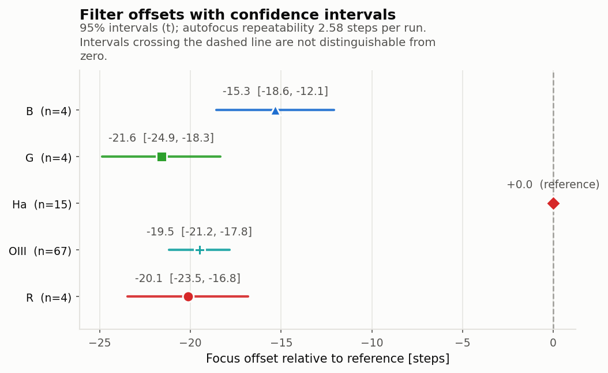
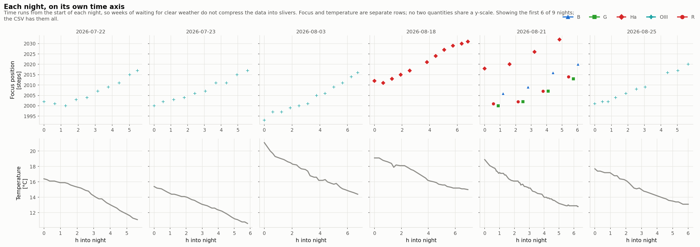

# Worked example -- a 46-day campaign, and whether nights can be compared

288 subs over 9 nights between 22 July and 7 September 2026, same rig as the
[single-night example](epsilon160-lrgb-2026-09-16.md). Mostly OIII on the
Methuselah Nebula, one night of Halpha, and one night that rotated B, G, R and Halpha
together. Mixed exposures (600 s narrowband, 120 s broadband).

```bash
filteroffset run OtherLights -o MethuselahOut --step-microns 2.0
```

## Result

| filter | offset vs Halpha (steps) | 95% CI | blocks |
|---|---|---|---|
| B | -15.32 +/- 1.63 | -18.57 ... -12.08 | 4 |
| G | -21.61 +/- 1.65 | -24.88 ... -18.34 | 4 |
| Halpha | 0 (reference) | -- | 15 |
| OIII | **-19.51 +/- 0.84** | -21.18 ... -17.83 | 67 |
| R | -20.15 +/- 1.67 | -23.47 ... -16.83 | 4 |

**k = -4.155 +/- 0.134 steps/C**, thermal lag 90 min, plus a drift of
+0.181 +/- 0.020 steps/day.



## The question this campaign forces

The nights break down like this:

| night | filters |
|---|---|
| 07-22, 07-23, 08-03, 08-25, 08-28, 09-05, 09-06 | OIII only |
| 08-18 | Halpha only |
| 08-21 | B, G, R, Halpha |

OIII never shares a night with anything. So whether it has a measurable offset
depends entirely on **whether focuser positions from different nights can be
compared at all**.

- If the imaging train is undisturbed, the absolute encoder puts every night on
  one scale, an OIII position from July is directly comparable with an Halpha
  position from August, and OIII's offset is measurable -- from 67 blocks, better
  determined than any other filter here.
- If the zero point wanders between nights, the only safe model puts a free level
  on each night. That protects the other offsets but absorbs OIII's completely,
  and there is then no number to report. (A least-squares solve will still return
  one: before this was tested, it produced `+2.46 +/- 0.70` with a confidence
  interval running to `+224` -- all of it an artefact of a rank-deficient system.)

## So it is tested

Residuals are averaged per night and split into a smooth trend and random jumps.
OIII is the anchor, since it appears on 7 nights and its own offset therefore
cannot be mistaken for a night's level.

| quantity | value |
|---|---|
| drift with date | **+0.145 steps/day** (p = 0.013) |
| drift over the campaign | +6.7 steps over 46 days |
| between-night scatter | 3.40 steps |
| ... after removing the trend | **1.74 steps** |
| within-night scatter | **2.64 steps** |
| jump ratio | **0.66** |
| verdict | **drift, no jumps** |

The detrended night-to-night scatter is *smaller* than the scatter within a
single night. Autofocus repeatability is the larger of the two, so there is
nothing left for per-night intercepts to absorb -- exactly what an undisturbed
imaging train predicts. What remains is a slow, smooth settling of about
0.15 steps/day, which one drift parameter absorbs without costing any offset its
identifiability.

Verified two ways: the trend is not an artefact of the thermal model (between-night
scatter stays 3.40-3.49 steps at every lag from 0 to 180 min), and it is a trend
rather than jumps (night means correlate with date at r = 0.86).

## Why the coefficient uses within-night variation only

The two estimators disagree, and the disagreement is not small:

| estimator | k (steps/C) |
|---|---|
| within-night contrasts only | **-4.155 +/- 0.134** |
| pooling in between-night contrasts | -3.01 |

Grouping by (night, filter) means every contrast compares two blocks of the same
filter on the same night, so the season, how long the rig had been cooling, and
where the target sat cannot reach it. **Temperature compensation corrects focus as
the night cools**, so the within-night figure is the one describing what the
focuser has to do. Pooling in between-night contrasts biases it toward zero.

The thermal lag is profiled on the same variation, because the within-night slope
is strongly lag-dependent -- -3.51 at zero lag against -4.16 at 90 minutes. Both
RSS and AICc show a clean minimum at **90 minutes**, and the same minimum appears
independently in the combined archive.

## Multi-night plotting

46 days elapsed contain 51 hours of imaging, so a continuous time axis would be
95% empty. Nights are drawn as separate panels, each on its own axis:



## Hot pixels, and why signal-to-noise cannot remove them

The 600 s OIII subs sit over a very dark sky, so sensor defects stand out. Raw
detections in one frame:

| flux quartile | median HFD |
|---|---|
| faintest 25% | 0.83 px |
| mid | 0.88 px |
| brightest 25% | 2.75 px |

Sub-pixel "stars" are impossible -- the same night's 120 s R frames give a flat
2.5 px. These are hot pixels and cosmic rays, and they are **bright**: raising the
threshold from 5sigma to 10sigma still left 2,642. Only a size test removes them. Each
frame's own bright stars set the scale, and detections far below it are discarded:
64% of that frame, after which its median reads **2.85 px**, flat across all four
quartiles. Across the archive the median rejection is 54%, against 8.5% on the
single-night dataset.

The screen is deliberately *not* applied to ASTAP, whose HFD rises steeply with
flux by construction so its faint stars legitimately read smaller; applying it
there discarded ~15% of genuine stars from a clean frame.

## What to do next

1. **One linking night** -- OIII alongside any of B/G/R/Halpha, each autofocused.
   OIII's offset currently depends on the no-jumps finding; a shared night would
   make it hold under either model, and it is an hour's work.
2. **Spread B, G and R over more nights.** All three come from 2026-08-21 alone,
   which is also why the report flags an apparent per-filter temperature slope
   difference -- within one night, temperature and time-of-night cannot be told
   apart, so a spurious slope is the expected symptom.
3. **Keep campaigns on one target separate.** Merging this archive with the
   Cocoon Nebula night shifts B, G and R by about 5 steps while OIII moves by
   0.07, because pointing-dependent flexure enters any between-night comparison.
   The tool flags mixed targets for this reason.
