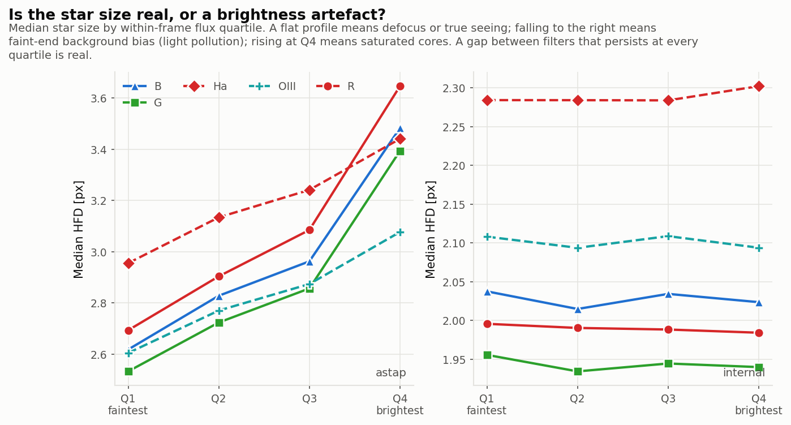

# Worked example -- a 46-day campaign, and whether nights can be compared

288 subs over 9 nights between 22 July and 7 September 2026, same rig as the
[single-night example](epsilon160-lrgb-2026-09-16.md): a Takahashi Epsilon 160ED
at f/3.3 with a QHY600M. Mostly OIII on the Methuselah Nebula, one night of Ha,
and one night that rotated B, G, R and Ha together. Mixed exposures (600 s
narrowband, 120 s broadband).

_Produced with filteroffset v0.6.0._

```bash
filteroffset run OtherLights -o MethuselahOut --step-microns 2.0
```

## Result

| filter | offset vs Ha (steps) | 95% CI | blocks |
|---|---|---|---|
| B | -12.99 +/- 0.96 | -14.42 ... -12.79 | 4 |
| G | -19.78 +/- 0.96 | -21.19 ... -19.61 | 4 |
| Ha | 0 (reference) | -- | 15 |
| OIII | **-15.08 +/- 0.52** | -17.13 ... -14.71 | 67 |
| R | -18.47 +/- 0.96 | -19.82 ... -18.27 | 4 |

**k = -3.589 +/- 0.102 steps/C**, plus a drift of +0.135 +/- 0.011 steps/day.
Autofocus repeatability 1.57 steps per run, R2 = 0.942 over 94 blocks.


## The question this campaign forces

The nights break down like this:

| night | filters |
|---|---|
| 07-22, 07-23, 08-03, 08-25, 08-28, 09-05, 09-06 | OIII only |
| 08-18 | Ha only |
| 08-21 | B, G, R, Ha |

OIII never shares a night with anything. So whether it has a measurable offset
depends entirely on **whether focuser positions from different nights can be
compared at all**.

- If the imaging train is undisturbed, the absolute encoder puts every night on
  one scale, an OIII position from July is directly comparable with an Ha
  position from August, and OIII's offset is measurable -- from 67 blocks, better
  determined than any other filter here.
- If the zero point wanders between nights, the only safe model puts a free level
  on each night. That protects the other offsets but absorbs OIII's completely,
  and there is then no number to report. (A least-squares solve will still return
  one: before this was tested, it produced `+2.46 +/- 0.70` with a confidence
  interval running to `+224` -- all of it an artefact of a rank-deficient system.)

## So it is tested

Residuals are averaged per night and split into a smooth trend and random jumps.
Ha and OIII are the anchors, since each appears on enough nights that its own
offset cannot be mistaken for a night's level.

| quantity | value |
|---|---|
| nights tested | 9 |
| anchor filters | Ha, OIII |
| drift with date | **+0.126 steps/day** (p < 0.001) |
| drift over the campaign | +5.8 steps over 46 days |
| between-night scatter | 2.29 steps |
| ... after removing the trend | **0.67 steps** |
| within-night scatter | **2.04 steps** |
| zero-point variance component | **0.00 steps** |
| verdict | **drift, no jumps** |

A night's mean residual scatters by `within-night sigma / sqrt(n)` even with a
perfectly stable zero point, so what matters is the *variance component*: how
much night-to-night spread survives once that expected sampling scatter is
removed. Here it survives at **zero**. There is nothing for per-night intercepts
to absorb -- exactly what an undisturbed imaging train predicts. What remains is
a slow, smooth settling of about 0.13 steps/day, which one drift parameter
absorbs without costing any offset its identifiability.

## The temperature coefficient

Temperature enters as two terms, because the within-night and between-night
responses differ:

| estimator | k (steps/C) |
|---|---|
| within-night contrasts (reported) | **-3.589 +/- 0.102** |
| pooling in between-night contrasts | -2.85 |

Every within-night contrast compares two blocks of the same filter on the same
night, so the season, how long the rig had been cooling, and where the target sat
cannot reach it. **Temperature compensation corrects focus as the night cools**,
so the within-night figure is the one describing what the focuser has to do.

**The thermal lag is not fitted by default.** Profiling it (`thermal_lag_minutes:
fit`) selects about 90 minutes on this archive and moves k to roughly -4.2, but
that search is not free: shrinking the within-night temperature amplitude scales
the slope up while leaving residuals nearly flat, and the quoted standard error
would ignore the fact that a search had happened. On simulated data containing
one true coefficient and no lag at all, fitting the lag inflated |k| by up to 22%.
Turning it off also made independent archives agree better, not worse. The
sensitivity table reports what it would change.

## Multi-night plotting

46 days elapsed contain 51 hours of imaging, so a continuous time axis would be
95% empty. Nights are drawn as separate panels, each on its own axis:


## Hot pixels, and why signal-to-noise cannot remove them

The 600 s OIII subs sit over a very dark sky, so sensor defects stand out. Raw
detections in one frame:

| flux quartile | median HFD |
|---|---|
| faintest 25% | 0.83 px |
| mid | 0.88 px |
| brightest 25% | 2.75 px |

Sub-pixel "stars" are impossible -- the same night's 120 s R frames give a flat
2.5 px. These are hot pixels and cosmic rays, and they are **bright**: raising the
threshold from 5 sigma to 10 sigma still left 2,642. Only a size test removes
them. Each frame's own bright stars set the scale, and detections far below it
are discarded: 64% of that frame, after which its median reads **2.85 px**, flat
across all four quartiles. Across this archive the median rejection is 54% (worst
frame 71%), against 8.5% on the single-night dataset.

The screen is deliberately *not* applied to ASTAP, whose HFD rises steeply with
flux by construction so its faint stars legitimately read smaller; applying it
there discarded ~15% of genuine stars from a clean frame.

The figure below shows the *result* of that screen rather than the raw
distribution above: after rejection the in-process measurement (right panel) is
flat across brightness, which is what a clean star sample looks like. The left
panel is ASTAP on the same frames, rising with flux by its own construction --
the two disagree on absolute scale by design, and only the frame-to-frame
pattern is used.



## What the report flags

Three warnings, and they are the right three:

- **Filter offsets rest on few autofocus runs** -- B, G and R have 4 blocks each.
- **Filters fall into groups that never share a night** -- `{B, G, Ha, R}` and
  `{OIII}`. The offsets are sound here because the zero point tested stable, but
  a single linking night would make them hold under either model.
- **Many detections discarded as too small to be stars** -- the hot pixels above.

## What to do next

1. **One linking night** -- OIII alongside any of B/G/R/Ha, each autofocused.
   OIII's offset currently depends on the no-jumps finding; a shared night would
   make it hold regardless, and it is an hour's work.
2. **Spread B, G and R over more nights.** All three come from 2026-08-21 alone.
3. **Keep campaigns on one target separate.** Merging this archive with the
   Cocoon Nebula night shifts B, G and R by several steps while OIII barely
   moves, because pointing-dependent flexure enters any between-night comparison.
   The tool flags mixed targets for this reason.
